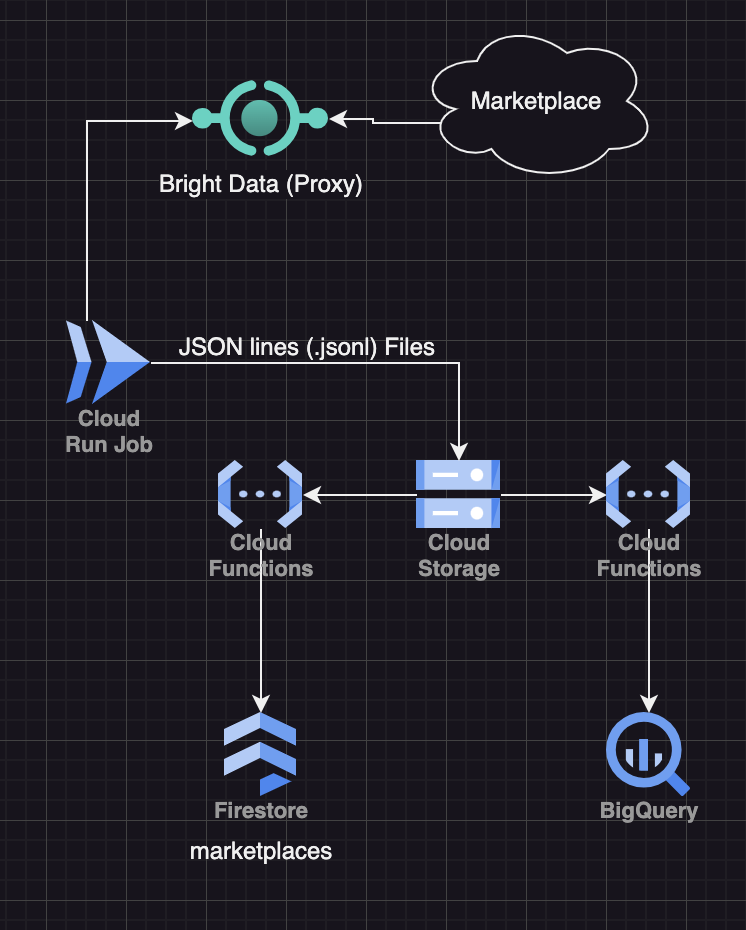

# Web Scraping

- This project uses a single Scrapy project containing all available spiders and scrapers.

## Proxy

- [Bright Data](https://brightdata.com/) - web scraping platform is our web proxy.

## Tech Stack

- Web Spiders and Scrapers are written in Python using [Scrapy](https://scrapy.org/)
- [Web Crawling with Python](https://brightdata.com/blog/how-tos/web-crawling-with-python)

## Hosting

- Starting with 1 web scraper now (Shopify) but will have 70+ scrapers (1 per marketplace).
- Web scrapers will run in [Cloud Run Jobs](https://cloud.google.com/run/docs/create-jobs) and will be deployed with GitHub Actions.

## Storage

- Extracted data is stored in [Google Cloud Storage](https://cloud.google.com/storage) with text stored in jsonlines (`.jsonl`) format.
- Cloud Functions are triggered using [Eventarc triggers](https://cloud.google.com/functions/docs/calling/eventarc) when new files are saved to Google Cloud Storage.

## Processing

- If the last modified date in the sitemap or page is newer than the last modified date passed into Scrapy, than the page is processed.
- Images are uploaded to Google Cloud Storage and the public URL is saved to Firestore and BigQuery.
- New files are imported into Firestore and BigQuery.

## Images

- Images are saved to Google Storage using [Media Pipelines](https://docs.scrapy.org/en/latest/topics/media-pipeline.html#using-the-images-pipeline).
- Images are converted to JPEG / RGB format

## Architecture

